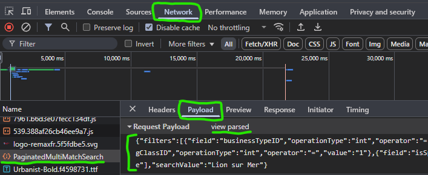

# REMAX Scalper

This project is a Python script that scrapes real estate listings from the REMAX website and stores relevant information in an SQLite database. It also sends notifications to a Telegram chat if certain conditions are met.

## Configuration

The script uses a `config.json` file to store configuration settings. Below is an example of the `config.json` file and an explanation of each setting:

```json
{
    "url": "https://www.remax.<SOME_DOMAIN>/api/Listing/PaginatedMultiMatchSearch",
    "base_url": "base_search_url",
    "filters": "see_next_steps_how_to_get_it",
    "bot_token": "your_telegram_bot_token",
    "chat_id": "your_telegram_chat_id",
    "max_listing_price": 200000,
    "send_telegram_msg": true
}
```

### Configuration Settings

- `url`: The URL of the Remax API endpoint for fetching listings.
- `base_url`: Depends on the region, but it's a prepend of the item's URL - `https://www.remax.fr/fr/mandats/<THE_SEARCH_ITEM>`
- `filters`: A JSON string containing the filters to apply when fetching listings. This should be a valid JSON string with the appropriate filters for your search criteria.
- `bot_token`: The token for your Telegram bot, obtained from BotFather.
- `chat_id`: The chat ID of the Telegram chat where notifications will be sent. This can be a user ID or a group chat ID.
- `max_listing_price`: The maximum listing price (in EUR) for which notifications will be sent. Listings with a price below this value will trigger a notification.
- `send_telegram_msg`: A boolean value indicating whether to send Telegram messages. Set this to `true` to enable notifications, or `false` to disable them.

For the `url`, you need to specify the domain: `com`, `fr`, `de`, etc., like this:
`https://www.remax.COM/api/Listing/PaginatedMultiMatchSearch`

`filters` can be obtained through the development console after performing the desired search. Look for:



Don't forget to select `view parsed` and copy the content.

In regard to the Telegram bot (`bot_token` and `chat_id`), you can find more information and create your bot using [Telegram BotFather](https://core.telegram.org/bots#botfather).

## Usage

1. **Create a Python Virtual Environment**:
   It is recommended to create a virtual environment to manage dependencies. You can create a virtual environment using the following commands:

   ```sh
   python -m venv .venv
   ```

   Activate the virtual environment:

   - On Windows:
     ```sh
     .venv\Scripts\activate
     ```
   - On macOS and Linux:
     ```sh
     source .venv/bin/activate
     ```

2. **Install Dependencies**:
   Ensure you have the required dependencies installed. You can install them using `pip`:

   ```sh
   python -m pip install requests asyncio python-telegram-bot
   ```

3. **Configure `config.json`**:
   Update the `config.json` file with your desired settings.

4. **Run the Script**:
   You can run the script using Python:

   ```sh
   python remax-scalper.py
   ```

5. **Schedule the Script** (Windows):
   To run the script periodically, you can use Task Scheduler on Windows. Create a `.vbs` file to run the script without a console window popping up and schedule it using Task Scheduler.

## Running the Script Using Task Scheduler (__Windows__)

To run the Python script using Task Scheduler without a console window popping up, you can use a `.vbs` (VBScript) file. Below is an example of the `run_remax_scalper.vbs` file:

```vbscript
Set objShell = CreateObject("WScript.Shell")
objShell.Run "C:\Path\To\Your\Python\Interpreter\pythonw.exe C:\Path\To\Your\Script\remax-scalper.py", 0, False
```

6. **Using `crontab`** (Linux):

## Open the Crontab File
   - Open a terminal and type `crontab -e` to edit the crontab file.

## Add a Cron Job
   - Add the following line to schedule the script to run daily at midnight:
     ```sh
     0 0 * * * /path/to/.venv/bin/python /path/to/remax-scalper.py
     ```
   - Replace `/path/to/.venv/bin/python` with the actual path to the Python interpreter in your virtual environment.
   - Replace `/path/to/remax-scalper.py` with the actual path to your Python script.

## Save and Exit
   - Save the changes and exit the editor. The cron job will now run the script daily at the specified time.

### Steps to Use Task Scheduler

1. **Create the `.vbs` File**:
   - Create a new file named `run_remax_scalper.vbs`.
   - Add the content shown above to the file.
   - Replace the paths with the actual paths to `pythonw.exe` and your Python script.

2. **Open Task Scheduler**:
   - Press `Win + R`, type `taskschd.msc`, and press `Enter`.

3. **Create a Basic Task**:
   - Click on `Create Basic Task` in the right-hand pane.
   - Name: `Run Remax Scalper`
   - Description: `Runs the remax-scalper.py script periodically`

4. **Set the Trigger**:
   - Choose `Daily`, then click `Next`.
   - Start date: `03/15/2025`
   - Start time: `12:00:00 AM`
   - Recur every: `1` days

5. **Set the Action**:
   - Choose `Start a program`, then click `Next`.

6. **Specify the Program to Start**:
   - Program/script: `C:\Path\To\run_remax_scalper.vbs` (Replace `C:\Path\To\run_remax_scalper.vbs` with the actual path to your `.vbs` file)

7. **Finish the Task**:
   - Review your settings, then click `Finish`.

This will create a task that runs your Python script daily at the specified time without a console window popping up. You can adjust the trigger settings to run the script at different intervals as needed.

## License

MIT License

Permission is hereby granted, free of charge, to any person obtaining a copy
of this software and associated documentation files (the "Software"), to deal
in the Software without restriction, including without limitation the rights
to use, copy, modify, merge, publish, distribute, sublicense, and/or sell
copies of the Software, and to permit persons to whom the Software is
furnished to do so, subject to the following conditions:

The above copyright notice and this permission notice shall be included in all
copies or substantial portions of the Software.

THE SOFTWARE IS PROVIDED "AS IS", WITHOUT WARRANTY OF ANY KIND, EXPRESS OR
IMPLIED, INCLUDING BUT NOT LIMITED TO THE WARRANTIES OF MERCHANTABILITY,
FITNESS FOR A PARTICULAR PURPOSE AND NONINFRINGEMENT. IN NO EVENT SHALL THE
AUTHORS OR COPYRIGHT HOLDERS BE LIABLE FOR ANY CLAIM, DAMAGES OR OTHER
LIABILITY, WHETHER IN AN ACTION OF CONTRACT, TORT OR OTHERWISE, ARISING FROM,
OUT OF OR IN CONNECTION WITH THE SOFTWARE OR THE USE OR OTHER DEALINGS IN THE
SOFTWARE.

